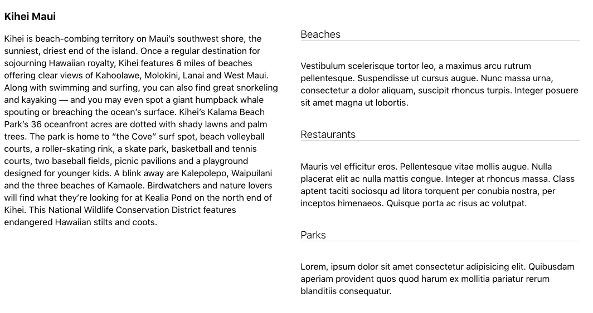

import {RegVideo} from './Video.js'

<RegVideo />
<br />

You know how it goes.  You’ve got an idea spinning around in your head. You’re convinced it’ll look great. But, when you actually see it, you have second thoughts. That’s where I was at this weekend, and the reason for this post.  I was working on a project and the intial idea I had wasn't turning out as expected.  The short story, it looked drab. The page had no life to it.  It needed some user interaction. 

A drop down of sorts seemed like it would help.  Now up to this point I was styling everything using CSS. The thought of installing Material UI or React-bootstrap was tempting.  After all, they have accordions that are all ready to go.  The problem though was that it seemed like a heavy hit (e.g., all the extra files that needed to be installed) for just one thing.  Besides, as previously mentioned, I was already invested in my CSS style sheets. React usRef to the rescue. 

This is what my intial mockup looks like.  I prefer to create a new project and experiment, rather than experiment on working project. 



This will explain why you see display flex in my CSS. 

Here is the Home page where the Article and Accordion components are imported. 

```js
const Home = () => {
return (
  <div className="wrapper">
    <div className="wrapper-flex">
      <Article />
      <div className="accordions">
        <Accordion title="Beaches">
            <p>Vestibulum scelerisque tortor leo, 
            a maximus arcu rutrum pellentesque. 
            Suspendisse ut cursus augue. Nunc 
            massa urna, consectetur a dolor 
            aliquam, suscipit rhoncus turpis. 
            Integer posuere sit amet magna ut 
            lobortis. </p>
        </Accordion>
        <Accordion title="Restaurants" >
            <p>Mauris vel efficitur eros. 
            Pellentesque vitae mollis augue. 
            Nulla placerat elit ac nulla mattis 
            congue. Integer at rhoncus massa. 
            Class aptent taciti sociosqu ad 
            litora torquent per conubia nostra,
            per inceptos himenaeos. Quisque 
            porta ac risus ac volutpat. 
            </p>
        </Accordion>
        <Accordion title="Parks" >
            <p>Lorem, ipsum dolor sit amet 
            consectetur adipisicing elit. 
            Quibusdam aperiam provident quos 
            quod harum ex mollitia pariatur 
            rerum blanditiis consequatur.</p>
        </Accordion>
        </div>
       </div>
    </div>
   )
}
```
Home CSS 

```css 
.accordions {
    margin-top: 3rem;
}

.wrapper {
    width: 1100px; 
    max-width: 100%;
    margin: 0 auto;
}

.wrapper-flex {
    display: flex;
    flex-wrap: wrap;
    justify-content: center;
}
```

The Accordion component 

```js
import React, {useState, useRef} from 'react'
import './styles.css'

const Accordion = (props) => {
 const [isActive, setIsActive] = useState(false);
 const cardRef = useRef()
 return (
   <div className="accordioncard">
    <h3 className="toggle"
      onClick={() => setIsActive(!isActive) }>
       {props.title}
    </h3>

    <div className="card-main" 
         ref={cardRef}
      style={
       isActive 
       ? {height: cardRef.current.scrollHeight + "px"}
       : {height: "0px"}
      }>
      <div>
         {props.children}
      </div>
     </div>
    </div>
   )
}

export default Accordion
```

Accordion CSS 

```css
.accordioncard {
    max-width: 500px;
    text-align: left;
    margin: 1rem;
}

.toggle {
    border-bottom: 1px solid lightgrey;
    cursor: pointer;
    font-weight: 300;
    transition: ease 0.3s;
}

.toggle:hover {
    color: lightseagreen;
    transform: translateX(5px)
}

.accordioncard .card-main {
    transition: height ease 0.5s;
    height: 0px;
    overflow: hidden;
}
```

So what's going on?  The Home page is passing the title and content (as children) to the Accordion component. Then you can see in the Accordian component I’m using a h3 tag as my toggle switch. That’s where the title is passed into.  Just below that you’ll see a div with the className of ```card-main```.  Inside of that div there is another div that takes in the content via props.children.

The real work is what’s happening between the h3 tag and the styles inside the div with the className ```card-main```. When the h3 tag is clicked, it will change the status of the useState from false to true and vise versa. When that happens, the useRef assigned to the constant cardRef will access the DOM and see what the required height will be to display the text in a given accordion card. It does this by accessing the current scrollHeight.  We get that number, attach "px" to the end of it, and then that number is assigned to the "height" style.  When the same card is selected again, the scrollHeight goes back to 0px. 