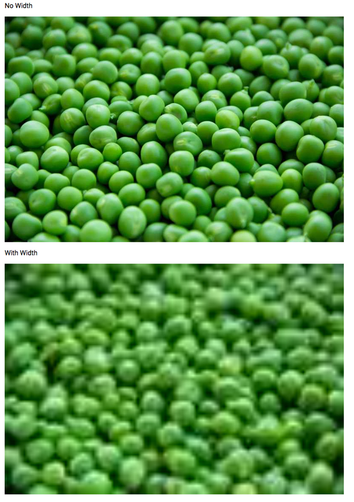

If you’re thinking about checking out Gatsby (a React-based open source framework), one of the cool features it offers is a library called gatsby-transformer-sharp.  In a nutshell, it allows you to leave the resizing and responsiveness of images up to Gatsby.  For example, let’s say you have an image that’s 2560x1400 and it’s 2.5MB in size.  Furthermore, you want to render this image in phone, tablet, and desktop displays.  In the past I would resize an image for each screen size, optimize it for the web, and then generate media queries to pull up the image when needed.  Gatsby takes care of all of this.  In fact, I can just drop an original image into and images folder and call it good.  

<br />

Now in spite of all of this coolness there is one gotcha that you should be aware of and the reason for this post. 

<br />

Gatsby refers to responsive images as “fluid” images.  Behind the scenes what Gatsby is doing is taking the images, resizing them, optimizing them for the web and putting them in to an html ```<source>``` tag and utilizing the "srcset" attribute. So in the end you’ll have a number of images at different widths; for instance, 200w, 400w, 800w, 1200w and 1600w.  Depending on the display Gatsby will serve up the most appropriate image size. 

```html
<source srcset="/static/6c828131a8e1479c3e74eea367/f836f/veg.jpg 200w,
/static/6c828131a8e1479c56bb3e3e74eea367/2244e/veg.jpg 400w,
/static/6c828131a8e1479c56bb3e3e74eea367/14b42/veg.jpg 800w,
/static/6c828131a8e1479c56bb3e3e74eea367/47498/veg.jpg 1200w,
/static/6c828131a8e1479c56bb3e3e74eea367/0e329/veg.jpg 1600w,
/static/6c828131a8e1479c56bb3e3e74eea367/00ce9/veg.jpg 4200w" 
sizes="(max-width: 800px) 100vw, 800px">
```

<br />

Now where this can get wonky is if you try to adjust the width of the image in the graphql object. For instance, you may think that you want to make sure the maxWidth is set to 100.  “Got to make sure it spans the width of the page!” Below is an example.  Fluid1 doesn't contain a maxMidth, but fluid2 does. 


```js
const exampleImage = graphql`
{
    fluid1: file(relativePath: {eq: "veg.jpg"}) {
        childImageSharp {
            fluid {
                ...GatsbyImageSharpFluid
            }
        }
    },
    fluid2: file(relativePath:{eq: "veg.jpg"}){
        childImageSharp{
            fluid (maxWidth: 100){
                ...GatsbyImageSharpFluid
            }
        }
    }
}
`
```


What you’re really doing though is telling Gatsby that the image size is 100w, therefore it will generate different sizes in the ```<source>``` tag.  You’ll likely end up with something like 25w, 50w, 100w, 150w, 200w.  Now even though the images will span the intended width, they’ll look very pixelated.


```html
<source srcset="/static/6c828131a8e147e3e74eea367/1075f/veg.jpg 25w,
/static/6c828131a8e1479c56bb3e3e74eea367/2c7f8/veg.jpg 50w,
/static/6c828131a8e1479c56bb3e3e74eea367/86e11/veg.jpg 100w,
/static/6c828131a8e1479c56bb3e3e74eea367/aabdf/veg.jpg 150w,
/static/6c828131a8e1479c56bb3e3e74eea367/f836f/veg.jpg 200w,
/static/6c828131a8e1479c56bb3e3e74eea367/00ce9/veg.jpg 4200w" 
sizes="(max-width: 100px) 100vw, 100px">
```

This is what you end up with. 



So if you end up with pixelated images and you adjusted the fluid maxWidth this is probably why it happened.