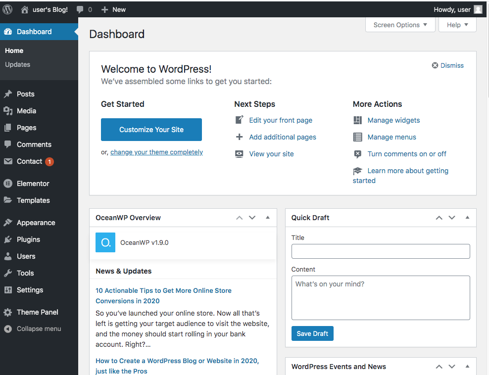

For quite some time I have scoffed at the idea of using Wordpress. I think this is because I've spent so much time honing my skills using ReactJS, NodeJS and a variety of other tools to make what I believe are "real" websites.

This changed the other day when I had an opportunity to make some money working on a Wordpress site. I had to turn it down because I was clueless about the platform. This got me thinking.  First, I passed up on what could have been some easy money.  And second, I market myself as a "solutions" provider. Now how can I be an effective solutions provider if I don't know anything about a platform used by more than 400 million people and accounts for nearly 75 million websites?

So today I embraced the Dark Side to see what Wordpress was all about.  I could hear Darth Vader: "Dave...if you only knew the power of the dark side".  

First impressions.  Wordpress is huge.  To the tune of a 663MB download. I installed it locally on my computer. Really, you don't need to buy a domain and hosting plan to work with it.  Getting past its ginormous download size and moving onto the dashboard, it's pretty clean looking. 

That said, some of these menu items nest pretty deep and for this reason it can be difficult to find what you're looking for.  For instance, if you want to change the color of a menu link this is the the path: appearance > customize > general options > general styling > link colors. I think this is where the real expertise of being a Wordpress developer comes in: memorizing the menu labyrinth. Of course there is the PHP component if one wants to customize parts of a project, but that doesnt' strike me as a big hurdle.  

Plugin Hell.  As of 2020 there are just over 57K Wordpress plugins.  Plugins provide everything from security, to making tables, SEO, picture carousels, video optimization and pretty much anything you can think of.  Now I imagine a lot of them do the same thing or at least very similar.  I've read that the average Wordpress site has about 20 plugins. The little project I'm working on currently has six. I need to up my plugin game. 

For end users, I can understand the appeal of Wordpress.  If someone can get it setup for them, all they have to do is go to Pages to make changes to existing content, or Posts to create a new page.  Give them about an hour of training and they're off to the races.  Moreover, it's easy to setup a shopping cart, interact with customers, etc. I get it.

I'll finish my little project.  I don't suspect I'll become a Wordpress Ninja, but at least I'll have a better understanding of how it works.  Moreover, if someone approaches me about a simple Wordpress site, I won't have to let the job slip through my fingers. 